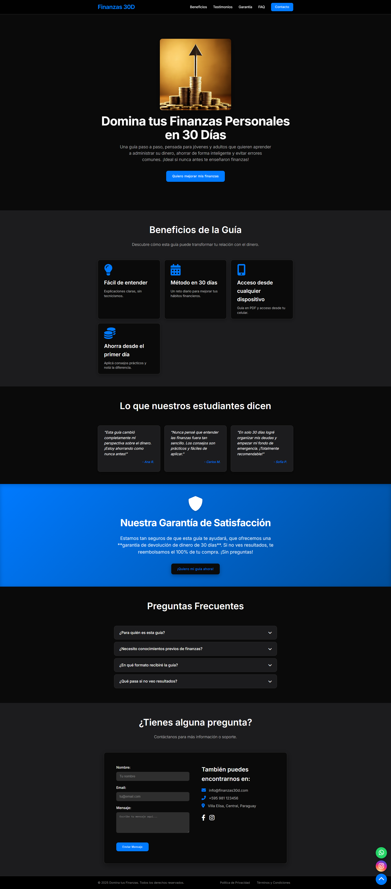

## 🔗 Links

# 💰 Landing Page - Finanzas Personales

Este proyecto es una **Landing Page** informativa y moderna dedicada al tema de **finanzas personales**, diseñada para captar la atención de usuarios interesados en mejorar su situación financiera.

El diseño está enfocado en la claridad, la confianza y la conversión, con secciones claves como testimonios, beneficios, seguridad de la información y medios de contacto.

## ✨ Características principales

- ✅ Diseño responsive (funciona en móvil y escritorio)
- 💬 Testimonio ficticio con enfoque emocional y creíble
- 🧩 Lista de beneficios claros y concretos
- 🔒 Sección de seguridad para generar confianza
- 📞 Formulario de contacto simple y funcional (sin backend)
- ⚡ Animaciones suaves y scroll fluido con JavaScript
- 🎨 Estilo limpio y profesional con CSS puro

## 🛠️ Tecnologías utilizadas

- HTML5
- CSS3
- JavaScript (vanilla)

## 🧱 Estructura del proyecto

## Screenshots

